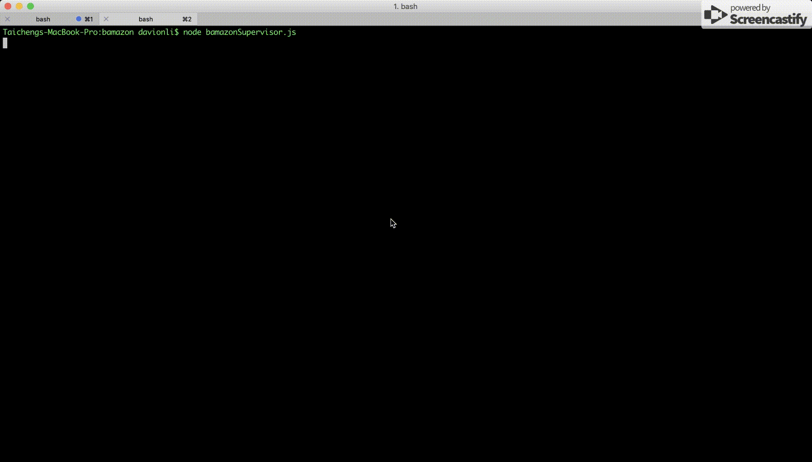

# bamazon

A bash/terminal command line app, built with node.js

Contains three clients, bamazonCustomer, bamazonManager, and bamazonSupervisor.

## Overview

### bamazonCustomer

The client for customer.

Customer can purhcase items from store.

### bamazonManager

The client for store manager.

Manager can 
* view items
* view items need restock
* add new items

### bamazonSupervisor

The client for store supervisor

supervisor can
* view profit of each department
* create a new department
* delete items

## Support

The app is supported by mySQL database

and contians the following npm libray:

* mysql

* inquirer

* cli-table

* dotenv